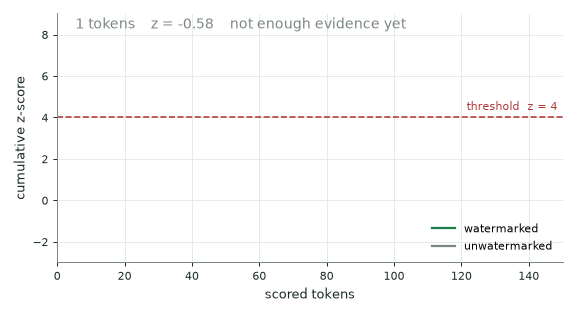
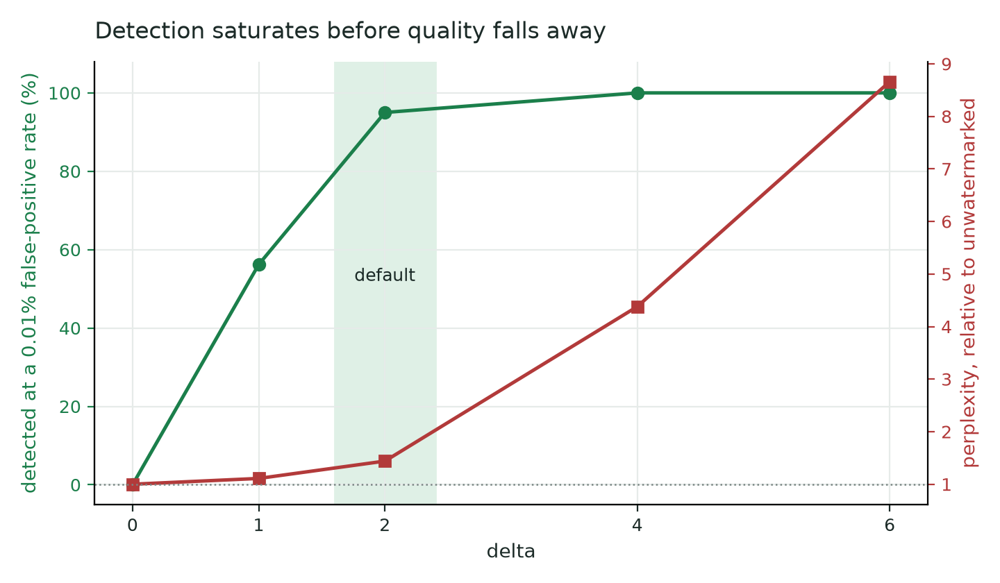
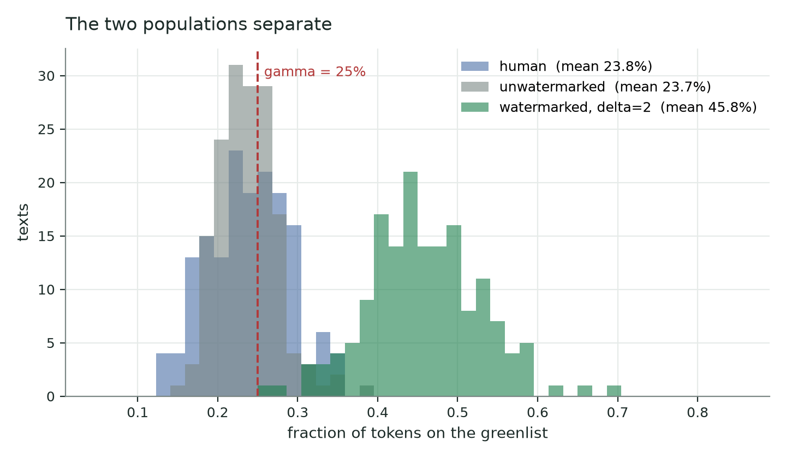
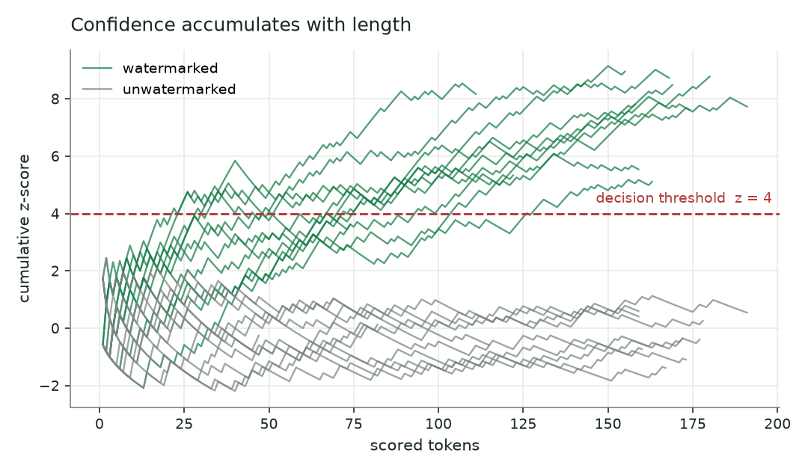

# llmwatermark

**Prove a language model wrote it — from the text alone, months later, with nothing but a
tokenizer and a secret key.**

Text produced by a model looks exactly like text produced by a person, and post-hoc
classifiers that guess from style are unreliable in both directions. Watermarking takes the
other route: leave the evidence at generation time.

At every step this library hashes the preceding tokens with your key, uses that to split the
vocabulary into a pseudorandom "greenlist" and the rest, and nudges the model toward the
greenlist. One token proves nothing — a quarter of them land there by chance. But across a
few dozen tokens the excess becomes a statistical signature that a one-proportion z-test
recovers, and nobody without the key can find it, reproduce it, or forge it.

Measured, not asserted — every number below comes from
[EVAL.md](tests/benchmarks/eval/EVAL.md) and [RESULTS.md](tests/benchmarks/RESULTS.md):

- **Detects** 95% of 256-token passages at a 0.01% false-positive rate (AUC 0.995).
- **Zero false positives** across 3200 human-written texts at the default threshold.
- **No quality cost** at the default strength, by held-out perplexity and by three blinded
  frontier judges.
- **~0.25 ms per decode step** on the torch backends, a fixed cost that shrinks as a share
  of the step as models grow - below measurement noise on a 1.5B model under `transformers`.
- **Detection needs no model, no GPU and no torch** — the detector is numpy and a tokenizer.
- **The same watermark works across backends**: the seed is HMAC-SHA256 and the greenlist
  mixer is verified bit-identical on numpy, torch-CPU and CUDA.

```python
from llmwatermark import generate_secret_key
from llmwatermark.adapters.transformers import config_for_model, watermark
from llmwatermark.detector import WatermarkDetector

key = generate_secret_key()
config = config_for_model(model, tokenizer, secret_key=key)

watermark(model, config)  # every generate() is now watermarked
text = generate_something(model, tokenizer)

WatermarkDetector(config, tokenizer).detect(text).is_watermarked  # True
```



## Install

```bash
pip install "llmwatermark @ git+https://github.com/HugoAlbertBonet/llmwatermark"
```

The core package and the detector depend on **numpy only**. Backends are extras:

| extra | for |
|---|---|
| `llmwatermark[transformers]` | watermarking a `transformers` model, Unsloth included |
| `llmwatermark[vllm]` | watermarking a vLLM engine |
| `llmwatermark[llama-cpp]` | watermarking a llama.cpp model |
| `llmwatermark[sglang]` | watermarking an SGLang engine |
| `llmwatermark[viz]` | matplotlib, for the plots and the animation |

Detection needs no extra at all - not the model, not torch, not a GPU.

## Detecting

The case that matters is someone handing you text and asking whether a model wrote it.

```python
from llmwatermark import WatermarkConfig
from llmwatermark.detector import WatermarkDetector

config = WatermarkConfig.from_tokenizer(
    tokenizer,
    vocab_size=model_vocab_size,  # what the model generates over; see the gotcha below
    secret_key=key,
)
result = WatermarkDetector(config, tokenizer).detect(text)

print(result.summary())
# WATERMARKED: z = 7.45 (threshold 4.00), p = 4.62e-14
# 118 of 160 scored tokens green (73.8%, expected 25.0% by chance); 178 tokens in total.
```

`detect()` also takes token IDs directly when you happen to have them. Below a documented
floor of scored tokens it raises rather than returning a confident number the text cannot
support.

### Seeing why

`DetectionResult` renders its own reasoning, with no dependencies:

```python
print(result.to_ansi())  # coloured token stream for a terminal
open("decision.html", "w").write(result.to_html(full_document=True))
result  # renders itself in a Jupyter cell
```

Four states, because green and red alone hide the interesting part: counted green, counted
red, **skipped because the context n-gram repeats**, and skipped because no context window
exists yet. Seeing three quarters of a passage struck out is what turns "the score looks
low" into "this text is too repetitive to score".

## Choosing delta

`delta` is the logit bias added to greenlist tokens: the one knob that trades text quality
for detectability.



| delta | detected at a 0.01% false-positive rate | perplexity vs unwatermarked | verdict |
|---|---|---|---|
| 1 | 56% | 1.11x | detection is a nice-to-have |
| **2** | **95%** | **1.44x** | **the default** |
| 4 | 100% | 4.38x | clear quality damage |
| 6 | 100% | 8.66x | severe |

Detection is near ceiling by `delta = 2`, and the quality cost arrives between 2 and 4.
Three independent judges and a held-out perplexity model agree on where that cliff sits.
At `delta = 2` the watermarked text is still *less* perplexing than human writing.

Full numbers and method: [EVAL.md](tests/benchmarks/eval/EVAL.md).

## How well it detects



On 256-token answers at `delta = 2`: **AUC 0.995**, 95% true-positive rate at a 0.01%
false-positive rate.

Scored over 3200 human-written texts, the detector's null distribution has mean z `+0.010`
and standard deviation `1.001` against a nominal `N(0, 1)`, with **zero** false positives
at the default threshold. Real prose repeats and reuses phrasing; the n-gram deduplication
is what absorbs that, and this is the measurement that it does.

Confidence grows as the square root of length, so short passages need more delta or a lower
threshold:



## Things that will bite you

**The watermark is not in the model.** Installing it changes no weights - it adds a bias
while the sampler runs. Save the model, load it under a different engine without this
library, and you get clean unwatermarked text, with no error and no warning. KGW is a
decode-time intervention, which is why every serving path needs its own adapter.

**Delta is rescaled by temperature.** The bias lands on raw logits and temperature divides
them, so the sampler sees `delta / temperature`. The same delta at `T = 0.5` and `T = 2.0`
is not the same watermark. Tune delta at the temperature you deploy at.

**`vocab_size` is what the *model* generates over, not `len(tokenizer)`.** Padded embedding
matrices make these differ - OPT-125m generates over 50272 IDs from 50265 tokenizer pieces,
Llama-3 over 128256 from 128000. Get it wrong and every greenlist differs. The config
carries a fingerprint of the vocabulary and the detector refuses loudly on a mismatch
rather than silently scoring nothing. Use `config_for_model()` / `config_for_llm()` and it
is taken from the right place.

**Detection from text re-derives the token IDs**, and that round trip is not guaranteed to
recover what the model emitted. A shifted boundary corrupts one context window. It degrades
the score; it does not break the method. Pass token IDs when you have them.

**The false-positive rate is per-key approximate, not exact.** Texts scored under one key
share a greenlist, so a per-key offset does not average away: measured sd 0.05-0.08 on human
writing, 0.154 on model output. The worst key observed moves the rate at `z = 4` from one in
31,600 to one in 7,700. A deployment needing a hard bound should measure its own key against
in-domain text.

**A negative result is weak evidence.** Below the threshold means "not enough evidence", not
"a human wrote this". Short text, light watermarking, heavy editing and paraphrase all
produce low scores on genuinely watermarked text. And the p-value is the chance of this
score *given no watermark* - not the chance there is no watermark. At scale, base rates
dominate: screen a million documents containing a hundred watermarked ones and a third of
your hits will be innocent.

## Performance

The watermark costs a **fixed ~0.25 ms per decode step** on the torch backends. It does not
scale with model size, so **every percentage below shrinks as the model grows** - the
watermark's cost stays put while the decode step it is measured against gets longer.

That makes the percentages meaningless without the model they were measured on:

| backend | model | precision | batch | step | overhead |
|---|---|---|---|---|---|
| transformers | Qwen2.5-1.5B | bfloat16 | 1 | 23.4 ms | below noise |
| vLLM | Qwen2.5-1.5B | bfloat16 | 32 | 11.8 ms | **+5.2%** |
| llama.cpp | Qwen2.5-**0.5B** | **Q4_K_M** | 1 | 2.9 ms | **+26.1%** |
| llama.cpp | Qwen2.5-1.5B | Q4_K_M | 1 | 5.6 ms | +16.3% |

Read down the `step` column rather than the `overhead` one. llama.cpp's 26% is mostly not
about llama.cpp: it is a 0.5B model in 4-bit, the cheapest decode step in the project at
2.9 ms, so a fixed cost occupies eight times the share it does under `transformers`. The
last two rows are the same backend and the same watermark on a bigger model, and the
overhead drops by a third. **Quantization shrinks every part of a decode step except the
watermark**, which is why the watermark looks worst exactly where the model is cheapest.

Two real effects remain underneath. llama.cpp runs the greenlist on the host in numpy
rather than as a fused GPU kernel, and it is single-sequence, so nothing amortizes across a
batch the way vLLM's does - about 900 us per generated token against vLLM's 19 us. On that
host path the cost is also not quite fixed: it grew from 765 us to 904 us between the two
llama.cpp rows, because a larger model evicts more of the working buffers between steps.

Extrapolating from the fixed cost, a 7B model at a 40 ms step puts the watermark under
0.6%. Numbers, method and what is still unexplained:
[RESULTS.md](tests/benchmarks/RESULTS.md).

Compilation is on by default (`compile="auto"`) because the eager path misses the budget by
an order of magnitude. Pass `compile=False` to turn it off.

## Backends

| backend | status |
|---|---|
| transformers | supported |
| vLLM | supported |
| llama.cpp | supported |
| SGLang | supported |
| Unsloth | supported, through the transformers adapter - see below |
| mlx-lm, ExLlamaV2/V3, TensorRT-LLM, LMDeploy | planned |

Adapters import their backend lazily, so installing the core package pulls none of them.

### SGLang

SGLang applies custom logit processors before temperature and before every warper, so delta
lands in the same place it does on the other backends. Two calls set it up - one for the
engine, one per request:

```python
import sglang

from llmwatermark import generate_secret_key
from llmwatermark.adapters.sglang import (
    config_for_engine,
    watermark_engine_kwargs,
    watermark_sampling_params,
)

key = generate_secret_key()
engine = sglang.Engine(model_path="Qwen/Qwen2.5-0.5B-Instruct", **watermark_engine_kwargs(key))
config = config_for_engine(engine, secret_key=key)

output = engine.generate(prompt, **watermark_sampling_params(config, max_new_tokens=256))
```

`watermark_engine_kwargs` takes the key rather than the config, because the engine is what
reports the vocabulary size a config needs, and the key has to reach the environment before
the scheduler process starts. It also passes `enable_custom_logit_processor=True`, which
SGLang requires, and it **turns off the overlap scheduler**.

That last part is not tuning, and it is worth understanding before you work around it.
Under overlap, SGLang starts the next forward pass before the previous token has been
appended to the request history, so a logits processor reads a history that is one token
stale. The watermark then keys each greenlist one position behind the detector, and
**nothing fails**: the logits are biased, the text is fluent, and it simply never detects.
Measured on Qwen2.5-0.5B at the default delta, overlap on gives a green fraction of 0.128
against a 0.25 chance rate; overlap off gives 0.500 from the same code. Because a silent
failure is worse than a slow one, the adapter also re-checks the setting inside the
scheduler and raises if an engine was built without these kwargs. Overlap is a throughput
feature, so watermarked SGLang serving costs something; that cost is not yet measured.

Every watermarked request needs `watermark_sampling_params`, since SGLang applies custom
processors per request rather than per engine. Ordinary sampling settings pass straight
through it. Speculative decoding is refused: draft positions are not in the request history
yet, so their greenlists cannot be computed rather than merely being inconvenient.

### Unsloth

Unsloth needs no adapter of its own. `FastLanguageModel.from_pretrained` returns a patched
transformers model, and generation still runs HuggingFace's sampling loop, so the
transformers adapter covers it:

```python
import unsloth  # before transformers, as Unsloth requires
from unsloth import FastLanguageModel

from llmwatermark import generate_secret_key
from llmwatermark.adapters.transformers import config_for_model, watermark

model, tokenizer = FastLanguageModel.from_pretrained("unsloth/Qwen2.5-0.5B-Instruct")
FastLanguageModel.for_inference(model)

config = config_for_model(model, tokenizer, secret_key=generate_secret_key())
watermark(model, config)  # every generate() is now watermarked
```

Two things are worth knowing, and both are tested in
[tests/test_adapter_unsloth.py](tests/test_adapter_unsloth.py) rather than assumed.

**Build the config after loading, not before.** Unsloth resizes the embedding matrix when a
chat template adds tokens, and rewrites `model.config.vocab_size` to match. The greenlist
partitions token IDs, so a config built from the base model would partition a different
vocabulary and its text would not detect. `config_for_model` reads the model, which is
already the right answer - Qwen2.5 ships with 151936 embedding rows against 151665 tokenizer
entries, and the model is the one that counts.

**A fine-tune that adds tokens needs its own config.** The same rule for the same reason:
watermark and detect with the vocabulary the model actually generates over.

You do not need Unsloth to detect. Detection reads text, so it runs anywhere numpy does.

## Examples

| script | needs |
|---|---|
| [`quickstart_transformers.py`](examples/quickstart_transformers.py) | `[transformers]` |
| [`quickstart_vllm.py`](examples/quickstart_vllm.py) | `[vllm]` |
| [`detect_text.py`](examples/detect_text.py) | core |
| [`show_decision.py`](examples/show_decision.py) - writes the HTML decision view | core |
| [`make_figures.py`](examples/make_figures.py), [`animate_detection.py`](examples/animate_detection.py) | `[viz]` |

## How it works

At each step the last `h` token IDs are hashed with your secret key into a seed; the seed
splits the vocabulary into a greenlist of size `gamma` and a redlist; `delta` is added to
the green logits before any sampling warper. Over many tokens the text accumulates a
statistically detectable excess of greenlist tokens.

Detection recomputes the same greenlists and runs a one-proportion z-test. It only asks
about the token actually emitted at each position, so it is `O(tokens)` and never builds a
greenlist at all.

The seed is `HMAC-SHA256`, so it is byte-identical across machines, Python versions and
libraries; the greenlist mixer is verified bit-identical across numpy, torch-CPU and CUDA.
That is what lets text watermarked on one backend detect on another.

## Development

```bash
pip install -e ".[dev]"
pytest                       # core tests: pure CPU, deterministic, always run
ruff check . && mypy
```

Backend tests are marked and skipped by default:

```bash
pytest --backend transformers
pytest --all-backends
```

## Licence

MIT. See [LICENSE](LICENSE).
